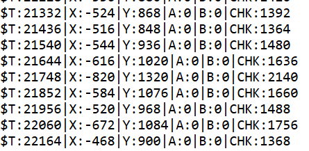

# Unidad 4

## Bitácora de proceso de aprendizaje

### Actividad 1 
- Es un código que genera líneas en el canva siempre y cuando el botón izquierdo del mouse este presionado.
- Mediante instrucciones, ya sean teclas oprimidas o dejadas de oprimir en el teclado hasta moviemientos detectados desde el mouse.

## Bitácora de aplicación 
### Actiividad 2

- Al crear un duplicado de `MicrobitAsciiAdapter` y nombrarlo `MicrobitAscii2Adapter`, se implementó una nueva función de parseo que incluye un checksum para validar la integridad de los datos recibidos.

```.js
function parseCsvLine(line) {
  const values = line.trim().split("|");

  if (values.length !== 6) throw new ParseError(`Expected 6 values, got ${values.length}`);

  // $T:tiempo|X:acel_x|Y:acel_y|A:estado_a|B:estado_b|CHK:checksum\n

  const t = Number(values[0].split(":")[1]);
  const x = Number(values[1].split(":")[1]);
  const y = Number(values[2].split(":")[1]);
  const btnA = Number(values[3].split(":")[1]);
  const btnB = Number(values[4].split(":")[1]);
  const chk = Number(values[5].split(":")[1]); 

  if (!Number.isFinite(x) || !Number.isFinite(y)) throw new ParseError("Invalid numeric data");
  if (x < -2048 || x > 2047 || y < -2048 || y > 2047) throw new ParseError("Out of expected range");
  if (![0, 1].includes(btnA) || ![0, 1].includes(btnB)) throw new ParseError("Invalid button data");
  
  const calc = Math.abs(x) + Math.abs(y) + btnA + btnB;
  if (calc !== chk) throw new ParseError("Hola, checksum mismatch");


  return { x: x | 0, y: y | 0, btnA: btnA === 1, btnB: btnB === 1 };
}
```

calculando el checksum como la suma de los valores absolutos de x e y, más los estados de los botones A y B, se puede verificar que los datos recibidos no han sido corrompidos durante la transmisión. Si el checksum calculado no coincide con el valor recibido, se lanza un error indicando que hay una discrepancia en los datos.

En el microbit 2, se implementó esta nueva función de parseo en el `bridgeServer.js`, permitiendo así una mayor robustez en la comunicación entre el dispositivo y el servidor.

y en el código del microbit, se modificó el formato de los datos enviados para incluir el nuevo campo de checksum, asegurando que el servidor pueda validar la integridad de los datos recibidos.

```.py
from microbit import *

uart.init(115200)
display.set_pixel(0,0,9)

while True:
    t = running_time()
    xValue = accelerometer.get_x()
    yValue = accelerometer.get_y()
    aState = 1 if button_a.is_pressed() else 0
    bState = 1 if button_b.is_pressed() else 0
    chk = abs(xValue) + abs(yValue) + aState + bState
    data = "$T:{}|X:{}|Y:{}|A:{}|B:{}|CHK:{}\n".format(t, xValue, yValue, aState, bState, chk
    )
    uart.write(data)
    sleep(100) # Envia datos a 10 Hz    
```

Finalizando la primera parte, se logró implementar un sistema de comunicación más robusto entre el microbit y el servidor, utilizando un checksum para validar la integridad de los datos transmitidos. Esto no solo mejora la confiabilidad del sistema, sino que también proporciona una base sólida para futuras expansiones o modificaciones en la comunicación entre dispositivos.



### Parte 2:

- En el `sketck.js` solo se modifican dos funciones que son `drawRunning()` y `updateLogic(data)`.

En el constructo se agregan estas dos variables: 
```.js
this.circleResolution = 5;
this.radius = 100;
```
En el `updateLogic(data)` se agrega: 

```.js
this.circleResolution = int(map(data.y, -2048, 2047, 2, 10));
this.radius = map(data.x, -2048, 2047, -width/2, width/2);
```
con esto se mapean los valores de X y Y (-2048 y 2047) a parametros del dibujo.

- La funcion `drawRunning()` quedó así:

```.js
  function drawRunning() {
  let mb = painter.rxData;

  if (!mb.ready) return;

  if (mb.btnA) {
    push();
    translate(width / 2, height / 2);

    let angle = TAU / painter.circleResolution;
    if (mb.btnB) {
      fill(34, 45, 122, 50);
    } else {
      noFill();
    }
    stroke(0);
    beginShape();
    for (let i = 0; i <= painter.circleResolution; i++) {
      let x = cos(angle * i) * painter.radius;
      let y = sin(angle * i) * painter.radius;

      vertex(x, y);
    }
    endShape();
    pop();
  }
```

Se cambio el código ya que este generaba líneas


## Bitácora de reflexión

