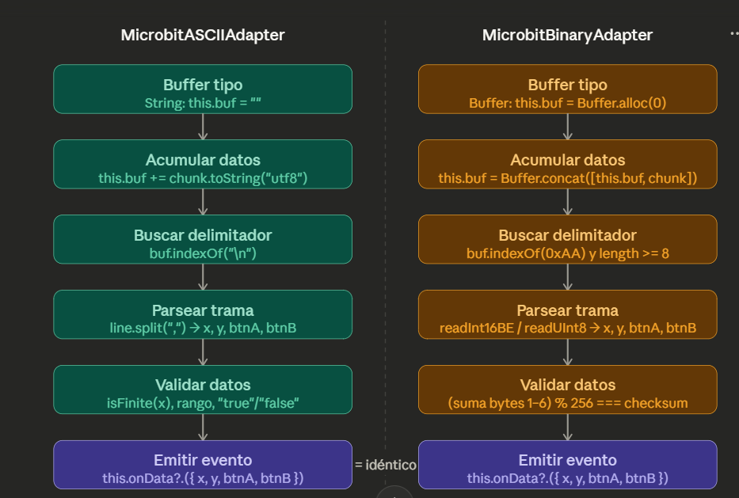

# Unidad 5
## Bitácora de proceso de aprendizaje

## Actividad 1

- ¿Qué ventajas y desventajas ves en usar un formato binario en lugar de texto ASCII?

`Ventajas:`
1. Mayor eficiencia en el almacenamiento y transmisión de datos, ya que los datos binarios ocupan menos espacio que los datos en formato de texto.
2. Mayor velocidad de procesamiento, ya que las computadoras pueden interpretar y manipular datos binarios más rápidamente que los datos en formato de texto.

`Desventajas:`
1. Menor legibilidad para los humanos, ya que los datos binarios no son fácilmenteinterpretables sin herramientas específicas, cosa que no sucede con el código ASCII

- Si xValue=500, yValue=524, aState=True, bState=False, ¿cómo se vería el paquete en hexadecimal? (Pista: convierte cada valor según su tipo y anota los bytes en orden.) Respuesta esperada: 01 F4 02 0C 01 00.

El paquete de hexadecimales es: fd 5c 03 28 00 00

### Paso 2

- ¿Por qué el protocolo ASCII de la unidad anterior no tenía este problema de sincronización? (Pista: piensa en qué rol cumplía el carácter \n.)

El `\n` en el protocolo ASCII actuaba como un delimitador claro entre los paquetes de datos, lo que facilitaba la sincronización. 

- ¿Por qué en binario no podemos usar \n como delimitador?

En un formato binario, el byte que representa `\n` (0x0A) podría aparecer como parte de los datos legítimos, lo que podría causar confusión en la interpretación del paquete. 

### Paso 3

- ¿Cuántos bytes tiene el paquete completo con framing? - ¿Cuántos más que sin framing?

El paquete completo con framing tiene 6 bytes, mientras que sin framing tendría 4 bytes.

- ¿Qué pasa si un byte de datos tiene el valor 0xAA (170 en decimal)? ¿Podría el receptor confundirlo con un header? ¿Cómo ayuda el checksum en este caso?

Se podría confundir y tomar el valor del byte de datos como un header, lo que podría causar errores en la interpretación del paquete. El checksum ayuda a detectar este tipo de errores, ya que si el paquete no coincide con el checksum esperado, el receptor sabrá que ha habido un error en la transmisión. 
 

## Bitácora de aplicación   

## Actividad 2

## Bitácora de reflexión