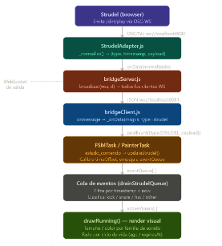

# Unidad 6

## Bitácora de proceso de aprendizaje

### Actividad 1:

- ¿Cuál es la diferencia entre recibir un mensaje y ejecutarlo?

La diferencia entre recibir un mensaje y ejecutarlo radica en que recibir un mensaje es simplemente la acción de obtener o recibir información, mientras que ejecutar un mensaje implica llevar a cabo una acción o proceso basado en esa información.

- ¿Por qué un sistema audiovisual puede necesitar timestamp además de los datos del evento?

Porque el tiempo le sirve para organizar los eventos en una secuencia lógica, permitiendo sincronizar diferentes elementos audiovisuales y asegurando que se ejecuten en el orden correcto.

- ¿Qué aspectos de la arquitectura de las unidades 4 y 5 permanecen intactos aunque ahora la fuente de datos ya no sea hardware?

Los aspectos de la arquitectura que permanecen intactos son la estructura general del sistema, la forma en que se procesan los eventos y la manera en que se comunican los diferentes componentes del sistema. Aunque la fuente de datos ya no sea hardware, el sistema sigue funcionando de manera similar en términos de cómo maneja y procesa los eventos.

**Paso 1**

- Si Strudel fuera “el dispositivo” de esta unidad, ¿Cuál sería su protocolo?

El protocolo de Strudel podría ser un formato específico de mensajes que contenga información relevante sobre los eventos, como el tipo de evento, la fuente del evento, los datos asociados y un timestamp para organizar los eventos en una secuencia lógica.

- ¿Qué variables mínimas necesitarías extraer para poder construir una visualización útil?

Las variables mínimas que necesitaría extraer para construir una visualización útil podrían incluir el tipo de evento, la fuente del evento, los datos asociados y el timestamp.
 
**Paso 2**

- ¿Qué problema resuelve la cola de eventos?

```cpp
{
  address: '/dirt/play',
  args: [
    'cps',   0.5,
    'cycle', 15.25,
    'delta', 0.5,
    's',     'tr909sd',
    'bank',  'tr909'
  ],
  timestamp: 1774966984435.2805
}
```
La cola de eventos resuelve el problema de organizar y gestionar los eventos de manera eficiente, permitiendo que se procesen en el orden correcto y evitando que se pierdan o se ejecuten de manera desordenada.

- ¿Por qué esta capa no pertenece al bridge sino al lado que interpreta el evento?

Porque es responsable de gestionar y organizar los eventos antes de que sean interpretados, asegurando que se procesen de manera eficiente y en el orden correcto. El bridge simplemente transmite los eventos, mientras que la capa de interpretación se encarga de manejarlos adecuadamente.

**Paso 3**

- ¿Qué papel cumple el Adapter en U4 y U5?

En la unidad 4, el Adapter se encarga de traducir los eventos provenientes del hardware a un formato que el sistema pueda entender y procesar. En la unidad 5, el Adapter sigue cumpliendo esta función, pero ahora se adapta a eventos que no provienen directamente del hardware, sino de otras fuentes de datos.

- ¿Qué Adapter necesitas ahora para que los eventos de Strudel no entren “crudos” al sistema visual?

Necesitaría un Adapter que pueda interpretar los eventos de Strudel y traducirlos a un formato que el sistema visual pueda entender, incluyendo la extracción de las variables relevantes y la organización de los eventos en una secuencia lógica basada en los timestamps.

## Bitácora de aplicación 


### Actividad 2:

1. Cómo configuraste Strudel para emitir eventos;

Strudel se configuró para enviar mensajes a través de WebSocket al puerto 8080 (el que abre ``StrudelAdapter``). El adapter escucha esa conexión y, cuando recibe un mensaje, verifica que tenga address: '/dirt/play' y un array args válido. Si cumple, lo normaliza: extrae s, delta, cps y cycle del array plano [key, val, key, val, ...] y produce un objeto estructurado con type: "strudel", timestamp y payload. Ese es el único formato que llega al resto del sistema.

2. Qué estructura final de mensaje decidiste usar;

```js
{
  type: "strudel",
  timestamp: <número en ms>,
  payload: {
    s: "bd",        // nombre del sonido
    delta: 0.5,     // duración en beats
    cps: 0.5,       // ciclos por segundo
    cycle: 0,
    bank: null,
    eventType: "noteEvent"
  }
}
```

3. Cómo conectaste bridgeClient.js, FSMTask, updateLogic y drawRunning;

El setup() de p5.js conecta las capas así: bridge.onData() recibe el mensaje del WebSocket y llama a painter.postEvent({type: "STRUDEL", payload}). La FSM, en estado_corriendo, detecta ese tipo y llama a updateStrudel(payload), que calibra el timeOffset y empuja el evento a eventQueue. Cada frame del draw() llama a drainStrudelQueue() (que procesa la cola y puebla activeVisuals) y luego a renderer.get(painter.state)?.(), que resuelve a drawRunning cuando el estado es estado_corriendo. El Map de renderizadores desacopla el estado de la lógica visual.

4. Cómo separaste recepción, cola temporal y renderizado

Hay tres responsabilidades bien diferenciadas. La recepción ocurre en bridge.onData() → postEvent(): solo convierte el mensaje en evento FSM. La cola temporal vive en updateStrudel() + drainStrudelQueue(): el evento se guarda con timestamp + timeOffset y solo se procesa cuando Date.now() >= timestamp, lo que sincroniza el visual con el audio. El renderizado es puro: drawRunning() solo lee activeVisuals y dibuja según age y family, sin tocar la cola ni la FSM.

5. Qué pruebas hiciste para verificar la sincronización

Las pruebas naturales con esta arquitectura son: verificar en consola que timeOffset se calcule una sola vez (firstStrudelTimestamp), confirmar que eventos con delta corto expiren rápido y los de delta largo persistan visualmente, y comparar el tiempo de arribo del evento vs el tiempo de aparición del círculo (deben coincidir con el beat audible). También se puede loguear el contenido de eventQueue en cada frame para confirmar que los eventos se drenan en el momento correcto.6. Qué problemas encontraste y cómo los solucionaste.

6. Qué problemas encontraste y cómo los solucionaste
El problema central es la deriva temporal: los timestamps de Strudel vienen en el reloj del browser que corre el sintetizador, que puede diferir del reloj del proceso Node. La solución fue calcular timeOffset = Date.now() - payload.timestamp en el primer evento y usarlo para ajustar todos los timestamps subsiguientes. Otro problema es que eventos sin campo s llegaban y rompían la clasificación; se resolvió con un guard if (!params.s) return null en _normalize().


## Bitácora de reflexión

1. Realiza un diagrama detallado del flujo de datos de tu sistema.




2. Compara las unidades 4, 5 y 6 en una tabla. 

¿Por qué sigue siendo la misma arquitectura? Las tres unidades comparten el mismo contrato de capas: un adapter normaliza la fuente, el bridgeServer la difunde por WebSocket, el bridgeClient la recibe, la FSM gestiona el estado y un módulo de render produce la salida visual. Lo que cambia es el origen del dato, no la estructura que lo transporta. Esto es exactamente el patrón de arquitectura hexagonal (puertos y adaptadores): el núcleo del sistema no sabe si el dato viene de un sensor de silicio o de un patrón musical.

3. Decisiones para traducir eventos musicales en visualidad

El mapeo se basa en la semántica sonora de cada elemento percusivo. El kick (bd) es el golpe más grave y con más energía baja, así que se representa con un círculo grande (80px) en rojo (255, 80, 80) — rojo porque es agresivo y central. El snare (sd/cp) tiene ataque medio y timbre metálico, mapeado a naranja (50px) por su calor intermedio. El hi-hat (hh) es el elemento más fino y agudo, mapeado a azul claro (25px) porque es tenue y aéreo. La posición aleatoria en pantalla refleja la distribución espacial del sonido en un mix. El delta controla la duración del visual: un evento largo en el patrón musical produce un círculo que persiste más tiempo, respetando la duración rítmica. El fade por age imita el envelope natural del sonido (ataque → decaimiento).

4. Integrar una tercera aplicación en el futuro

Conservaría: todo el núcleo — bridgeServer.js, bridgeClient.js, FSMTask, el sistema de cola temporal con timeOffset, y el patrón renderer Map. Estos forman el esqueleto reutilizable. También conservaría la interfaz de adapter (onData, onConnected, onDisconnected, onError) ya establecida.
Cambiaría o añadiría: un nuevo adapter específico para la fuente (p.ej. MidiAdapter, SensorAdapter de otro dispositivo). Si la nueva fuente tiene una semántica distinta, crearía un nuevo schema de payload sin romper los existentes. Para múltiples fuentes simultáneas, el drainStrudelQueue podría generalizarse a un sistema de colas con prioridad por tipo de evento. Y si se necesitan múltiples renders, el Map de renderizadores ya está preparado para escalar: solo hay que agregar más entradas renderer.set(estado, funcionRender).
