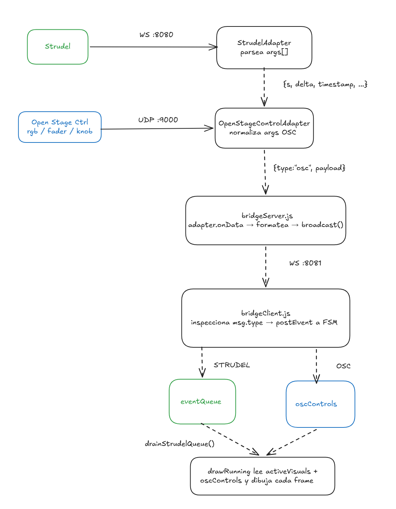
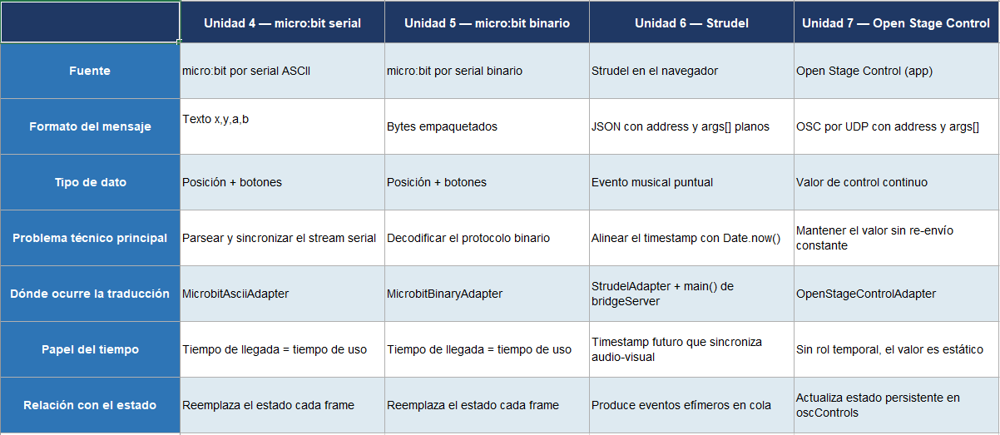

# Unidad 7

## Bitácora de proceso de aprendizaje

1. ¿Qué diferencia hay entre un evento musical y un mensaje de control?

Un evento musical (Strudel) ocurre en un momento exacto y dura un tiempo determinado — es temporal. Un mensaje de control (Open Stage Control) cambia  y se mantiene hasta que se vuelva a mover.

2. ¿Qué quiere decir que un parámetro del sistema sea persistente?

Que no necesita llegar cada frame para tener efecto.

3. ¿Qué partes del sistema de la unidad 6 permanecen intactas en este nuevo caso?

FSMTask, BridgeClient, bridgeServer.js, StrudelAdapter, la cola de eventos (eventQueue), y drainStrudelQueue. 

## Bitácora de aplicación

1. Cómo configuraste Open Stage Control;

Se ejecuta como servidor local. En la configuración se apunta el puerto OSC de salida al 9000 (el que escucha OpenStageControlAdapter). La sesión se carga desde el archivo OSCUI.json que define los widgets.

2. Qué widgets decidiste usar y por qué;

- **rgb_1 — color picker**, porque permite modificar el tinte de todos los visuales con un solo gesto intuitivo.
- **fader_1 — fader vertical**, porque el gesto de subir/bajar es naturalmente análogo a "más grande / más pequeño".
- **knob_1 — knob rotativo**, porque la rotación es intuitiva para controlar velocidad o tempo.


2. Qué estructura final de mensaje decidiste usar para los controles;

```json
{ "type": "osc", "payload": { "address": "/fader_1", "args": [0.75] } }
```

2. Cómo conectaste bridgeClient.js, FSMTask, updateLogic y drawRunning;

bridge.onData inspecciona msg.type. Si es "osc" despacha { type: "OSC", payload } a la FSM. estado_corriendo lo recibe y llama updateOSC, que escribe en oscControls. drawRunning lee oscControls cada frame sin saber cuándo llegó el último mensaje.

3. Cómo integraste ambas fuentes de datos en el mismo frontend;

Strudel escribe en eventQueue (temporal). OSC escribe en oscControls (persistente). drawRunning lee ambos sin que se interfieran: la cola produce visuales efímeros, los controles modulan cómo se ven.

4. Qué pruebas hiciste para verificar que el control paramétrico funciona sin romper la sincronización de Strudel;

- *Mover el fader mientras sonaba el patrón:* el tamaño de los visuales cambiaba en tiempo real sin cortar el ritmo.
- *Girar el knob al máximo:* las animaciones se aceleraban visiblemente sin desfase adicional.
- *Cambiar el color en el picker:* el tinte afectaba los próximos visuales sin romper los que ya estaban en pantalla.

5. Qué problemas encontraste y cómo los solucionaste.

El principal fue que updateLogic recibía el payload de Strudel porque bridge.onData no discriminaba msg.type correctamente al inicio. Se resolvió agregando el guard if (!data || typeof data.x !== "number") en updateLogic y separando los tres casos (microbit, strudel, osc) explícitamente en bridge.onData.

Otro problema fue la desicronización de los visuales y el sonido. El principal error era que el tiempo de ejecución de los visuales era en tiempo real, lo cual no era correcto, necesitaba que generase los visuales en un momento predetermindao. 

## Bitácora de reflexión
1.  Realiza un diagrama detallado del flujo de datos completo de tu sistema. Debe incluir al menos:



2. Compara en una tabla las fuentes de datos que has trabajado en las unidades 4, 5, 6 y 7. Compara al menos:



3. Explica por qué Open Stage Control no debe tratarse igual que Strudel dentro de la arquitectura.

Strudel envía eventos que ocurren una vez, en un momento preciso, y desaparecen. Necesitan una cola porque su orden y timing importan. Open Stage Control envía el estado actual de un control — no importa cuándo llegó, solo importa cuál es el valor ahora. Meterlo en la cola sería incorrecto porque no es un evento temporal sino una actualización de parámetro.

4. Justifica los tres controles que elegiste:

- `rgb_1:` Modifica el color de los visuales, el color es la variable visual más inmediata e intuitiva,hace cambiar de color elementos activos en tiempo real lo que hace que sea sencillo de reconocer e interactuar 
- `fader_1:` Modifica la escala del tamaño del círculo princila, permite ajustar la intensidad visual sin cambiar el patrón musical, los círculos crecen o se encogen
- `knob_1:` Modifica la velocidad de la animación, permite desacoplar la velocidad visual del tempo de Strudel, las animaciones se consumen más rápido o más lento

5. Si tuvieras que integrar una tercera fuente de control en el futuro, ¿Qué partes de tu arquitectura actual conservarías y cuáles extenderías?

Conservaría todo: FSMTask, BridgeClient, bridgeServer.js, y el patrón de adapters. Solo necesitaría agregar un nuevo adapter, registrarlo en createAdapter o como adapter secundario igual que OpenStageControlAdapter, agregar su msg.type en bridge.onData, y decidir si su dato es temporal o no.