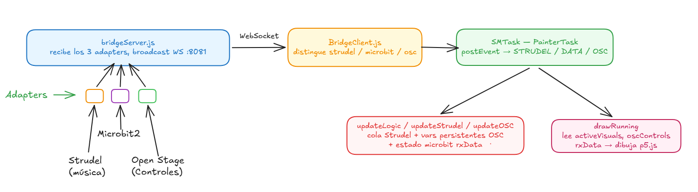

# Unidad 8

## Bitácora de proceso de aprendizaje

- Un diagrama inicial de la arquitectura;



- Los adapters que vas a usar;

1. **StrudelAdapter**
2. **MicrobitAscii2Adapter**
3. **OpenStageControlAdapter**

- El contrato de mensajes de cada fuente;

1. `type: "strudel"` \
   timestamp: number \
   payload.s: "bd" | "sd" | "hh" \
   payload.delta: number \
   payload.cps: number

2. `type: "microbit"` \
   x: int (−2048…2047) \
   y: int (−2048…2047) \
   btnA: boolean \
   btnB: boolean

3. `type: "osc"` \
   payload.address: string \
   /rgb_1 → args [r, g, b] \
   /scale → args [0…1] \
   /layer → args [0 | 1]

- Los errores encontrados y cómo los solucionaste.

El primer problema que encontre fue el como unir los adapter sin crear una lógica nueva.

Priemro intenté ejecutar los adapters deseados por en terminales distintas, pero generaba error. El problema radicaba en que el `microbit` y el `strudel` se ejecutaban en el mismo puerto, por lo que decidí crear un nuevo strudel p'ara que funcionase paralelo al microbit

```js
const strudelPort = parseInt(getArg("strudelPort", "8080"), 10);
const strudelAdapter = new StrudelAdapter({ port: strudelPort });

strudelAdapter.onData = (d) => {
  console.log("STRUDEL LLEGÓ:", d);
  broadcast(wss, d);
};

await strudelAdapter.connect();
```

Al agregar esto el código se ejecutó correctamente, pero no se lograba visializar el strudel, pero al ejecutarlo por por separado el canva dibujaba y mostraba los graficos deseados.

Para solucionar este problema decidí ir revisar si el error estaba en la llegada de los datos, este no era el problema ya que de igual forma llegaban los datos que emitía el microbit.

El problema estaba en que el strudel constantemente dibujaba en el canva cosa que no hacía el `srudel` haciendo que este no se visualizara por lo cual bajé el color del fondo para el strudel.

## Bitácora de aplicación

- El concepto de la obra;

  _`“RITUAL DIGITAL AFROFUTURISTA”`_

  La obra representa:
  - Ritmo ancestral
  - Cuerpo
  - Tecnología
  - Memoria
  - Expansión visual

  | Fuente   | Significado             |
  | -------- | ----------------------- |
  | Strudel  | pulso ritual            |
  | OSC      | transformación espacial |
  | microbit | cuerpo humano           |

- El rol de micro:bit, Strudel y Open Stage Control;

- Las decisiones visuales, musicales y performáticas;

_`“MODO CLÍMAX”`_

Solo ocurre si:

| Fuente   | Condición          |
| -------- | ------------------ |
| Strudel  | hay kick activo    |
| OSC      | speed > 2          |
| microbit | botón A presionado |

- Los cambios realizados entre la iteración ingenieril y la iteración estética;
- Evidencias de ensayo.

1. Código de strudel

```.
setcps(0.5)

// ─── BASS ───
let bassLine = note(`
<
~ ~ [c2] ~
~ [c2 c3] ~ ~
[c2 c3]*2 ~ ~ ~
[c2 c3]*4 [bb2 bb3]*2
>*2
`)
.sound("gm_synth_bass_1")
.lpf(slider(1000, 0, 1000))


// ─── LEAD ───
let leadLine = n(`
<
~ ~ ~ ~
[~ 0] ~ ~ ~
[~ 0] 2 [0 2] ~
[~ 0] 2 [0 2] [~ 2]
>*2
`)
.scale("C4:minor")
.sound("gm_synth_strings_1")


// ─── DRUMS ───
let drumLine = sound(`
<
bd ~ ~ ~
bd*2 ~ ~ ~
bd*4 [~ sd] ~ ~
bd*4 [sd cp]*2 [~ hh]*2
>*2
`)
.bank("tr909")


// ─── HIHATS ───
let hhLine = sound(`
<
~ ~ ~ ~
~ ~ hh*4 ~
~ hh*8 ~ ~
hh*16
>*2
`).gain(sine)


// ─── OUTPUT ───
$: stack(bassLine, bassLine.osc())
$: stack(leadLine, leadLine.osc())
$: stack(drumLine, drumLine.osc())
_$: stack(hhLine, hhLine.osc())
```

## Bitácora de reflexión
